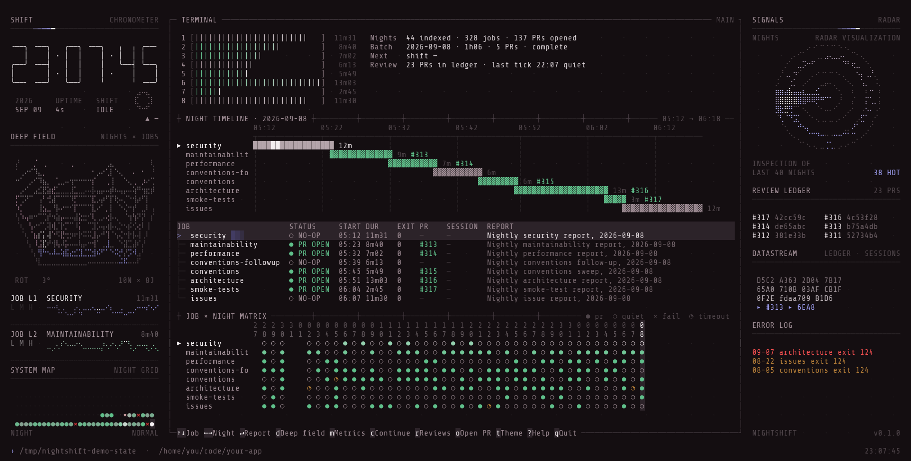

  

  
  
  
  
  

  <a href="../../README.md">English</a> · <a href="README.zh-CN.md">中文</a> · 日本語 · <a href="README.ko.md">한국어</a> · <a href="README.es.md">Español</a> · <a href="README.fr.md">Français</a> · <a href="README.pt.md">Português</a>

  <strong>寝ている間に、コードが良くなる。</strong> 
  夜にコーディングエージェントを起こし、小さな仕事をひとつ渡し、朝までにプルリクエストを残しておく手伝い役です。

<h3 align="center"><a href="#はじめ方"><ins>ひとことで設定できます</ins></a></h3>

  

## これは何？

Nightshift は、夜に働く手伝い役です。

コーディングエージェントを起こします。エージェントに小さな仕事をひとつ渡します。エージェントはコードを見て、その仕事をします。直す価値のあるものが見つかれば、あなたが確認できるようにプルリクエストを開きます。それから次の仕事に移ります。

朝になったら、何をしたか読みます。何も見つからない夜も多いです。それでいいのです。悪い変更より、何もしない方がましです。

2時間ごとに、開いているプルリクエストも読んで、短いレビューを残します。

## 機能

<table>
<tr>
<td width="50%" valign="middle">

### 一度にひとつの小さな仕事

9つのジョブを、順番にひとつずつ実行します。セキュリティ、バグ、保守性、パフォーマンス、規約、アーキテクチャ、スモークテスト、issue。それぞれのジョブが、エージェントをまるごと独り占めして、ほかのことはしません。

[ジョブ一覧 →](#ジョブ一覧)

</td>
<td width="50%">
  
</td>
</tr>
<tr>
<td width="50%" valign="middle">

### 朝までにプルリクエスト

開くのはプルリクエストだけです。main には何も push しません。勝手にマージもしません。コーヒーを飲みながら読んで、気に入ったものだけマージしてください。

[安全ですか？ →](#安全ですか)

</td>
<td width="50%">
  
</td>
</tr>
<tr>
<td width="50%" valign="middle">

### 2時間ごとのレビュー係

2つ目のタイマーが、開いているプルリクエストを読んで、短いレビューを残します。何か見つけない限り、静かにしています。

[レビュー係の動き方 →](../../review/SKILL.md)

</td>
<td width="50%">
  
</td>
</tr>
<tr>
<td width="50%" valign="middle">

### 邪魔をしない

push する前に、ガードがすべてのファイルを、開いているすべてのプルリクエストと照らし合わせます。仲間がすでにそのファイルを触っていたら、ジョブはその変更を捨てて、そう報告します。

[すべてのジョブが守るルール →](../../jobs/_common.md)

</td>
<td width="50%">
  
</td>
</tr>
<tr>
<td width="50%" valign="middle">

### コンソール

すべての夜と、すべてのジョブを、ひとつの画面に。時計、直近40夜のレーダー、そして各ジョブが何をしたかのグリッド。必要なのは Node だけです。

[コンソールを開く →](../../tui/README.md)

</td>
<td width="50%">
  
</td>
</tr>
<tr>
<td width="50%" valign="middle">

### 会話の続きから

どのジョブでも `c` を押すと、コンソールがその夜のやりとりを開き直します。なぜそうしたのかエージェントに聞けます。次に何をするか指示できます。

[会話を続ける →](../../tui/README.md#continue-a-conversation)

</td>
<td width="50%">
  
</td>
</tr>
</table>

**ほかにも入っています:**

- **[やさしい言葉で書かれたジョブ](../../jobs)** — どのジョブも、やさしい言葉で書かれた1ページです。読んでください。変えてください。自分のを足してください。
- **[あなたの好みを学ぶ](../../jobs/_common.md)** — ジョブは始める前に、あなたが過去のプルリクエストで言ったことを読みます。
- **[あなたのチェックを走らせる](../../nightshift.conf.example)** — Lint、型チェック、テスト。どのジョブも、何かを開く前にこれらを通さなければなりません。
- **[仕事中は飛ばす](../../nightshift.conf.example)** — ノートパソコンが寝ていたら、その夜は飛ばします。日中の真ん中で走ることはありません。
- **[ログはリポジトリの外に](../../SETUP.md)** — やったことはすべて、コードの中ではなく、あなたのコンピュータ上のフォルダに書かれます。

---

## ジョブ一覧

| ジョブ                 | 探すもの                                                                       |
| ---------------------- | ------------------------------------------------------------------------------ |
| `security`             | 悪意ある人が使える本物の穴。「いつか困るかも」という心配は対象外。               |
| `bugs`                 | ユーザーが気づくバグ。はっきりしたものだけ。                                     |
| `maintainability`      | 変えにくいコード。それを単純にします。                                           |
| `performance`          | 人が体感する遅い場所。まず計測します。                                           |
| `conventions`          | あなた自身が書いたルールを破っている場所。安全な修正だけ。                       |
| `conventions-followup` | 本格的な変更が必要なルール違反。一晩にひとつのテーマ。                           |
| `architecture`         | コードをもっと単純にできる、いちばん大きな方法をひとつ。                         |
| `smoke-tests`          | アプリがまだ開くか確かめる、静かなテストを少し。たいてい何もしません。           |
| `issues`               | 小さくてはっきりした GitHub issue をひとつ。簡単なものは新しい人のために残します。 |
| `review`               | 2時間ごとに開いているプルリクエストを読みます。何か見つけない限り静かです。      |

どのジョブも同じルールを守ります。ルールは [`jobs/_common.md`](../../jobs/_common.md) にあります。要するに:

- まずリポジトリ自身のガイドファイルを読む。そちらが優先。
- オーナーが過去のプルリクエストで言ったことを読む。好みを学ぶ。
- 他の人の開いているプルリクエストが触っているファイルには、決して触らない。
- リポジトリのチェックを走らせる。壊れたものは直す。
- プルリクエストを開くか、開かない理由を言う。main ブランチには決して push しない。

---

## 対応エージェント

質問せずにターミナルから動かせる**どのコーディングエージェント**でも使えます。[`nightshift.conf.example`](../../nightshift.conf.example) の中から、合う `AGENT` の行を選んでください。

  <a href="https://docs.anthropic.com/claude/docs/claude-code"><kbd> Claude Code</kbd></a> &nbsp;
  <a href="https://github.com/openai/codex"><kbd> Codex</kbd></a> &nbsp;
  <a href="https://cursor.com/cli"><kbd> Cursor</kbd></a> &nbsp;
  <a href="https://github.com/google-gemini/gemini-cli"><kbd> Gemini CLI</kbd></a> &nbsp;
  <a href="https://docs.github.com/en/copilot/how-tos/set-up/install-copilot-cli"><kbd> GitHub Copilot</kbd></a> &nbsp;
  <a href="https://hermes-agent.nousresearch.com/docs/"><kbd> Hermes</kbd></a> &nbsp;
  <a href="https://github.com/openclaw/openclaw"><kbd> OpenClaw</kbd></a> &nbsp;
  <a href="https://opencode.ai/docs/cli/"><kbd> OpenCode</kbd></a> &nbsp;
  <a href="https://aider.chat/"><kbd> Aider</kbd></a> &nbsp;
  <a href="https://ampcode.com/manual#install"><kbd> Amp</kbd></a> &nbsp;
  <a href="https://block.github.io/goose/docs/quickstart/"><kbd> Goose</kbd></a> &nbsp;
  <a href="https://github.com/QwenLM/qwen-code"><kbd> Qwen Code</kbd></a> &nbsp;
  <a href="https://docs.factory.ai/cli/getting-started/quickstart"><kbd> Droid</kbd></a> &nbsp;
  <a href="https://docs.cline.bot/cline-cli/overview"><kbd> Cline</kbd></a> &nbsp;
  <kbd>+ 「すべてに yes」フラグのあるエージェントなら何でも</kbd>

---

## はじめ方

コーディングエージェントにこう伝えてください:

> Get github.com/openslop/nightshift and set it up for my code at ~/code/my-app. Read SETUP.md there and follow it.

（意味: 「github.com/openslop/nightshift を取ってきて、~/code/my-app にある私のコード用に設定して。そこにある SETUP.md を読んで、その通りにして。」）

これだけです。エージェントがいくつか質問して、あなたのコンピュータにタイマーを2つ設定し、メモの置き場所を教えてくれます。

macOS、Linux、Windows で動きます。手で設定したいなら、[`SETUP.md`](../../SETUP.md) がエージェントの従うページです。

### 見てみる

  

コーディングエージェントにこう伝えてください:

> Open the Nightshift console. Read ~/nightshift/tui/README.md and start it.

（意味: 「Nightshift のコンソールを開いて。~/nightshift/tui/README.md を読んで、起動して。」）

Node が必要です。ジョブの上で `c` を押すと、何をしたかエージェントと話せます。ほかは `?` を押してください。

## 中身

- [`jobs/`](../../jobs) には、ジョブごとに1ページ、やさしい英語で書かれています。読んでください。好きなら変えてください。
- [`jobs/_common.md`](../../jobs/_common.md) には、すべてのジョブが守るルールがあります。
- [`review/SKILL.md`](../../review/SKILL.md) は、レビュー係の動き方を書いています。
- [`nightshift.conf.example`](../../nightshift.conf.example) は設定ページです。エージェントがコピーを埋めます。
- [`SETUP.md`](../../SETUP.md) は、エージェントが設定のときに従うページです。
- [`bin/`](../../bin) には、タイマーが動かす小さなスクリプトが3つあります。読む必要はありません。
- [`tui/`](../../tui) はコンソールです。[`tui/README.md`](../../tui/README.md) に開き方があります。

## 安全ですか？

- 開くのはプルリクエストだけです。何をマージするかは、あなたが決めます。
- 他の開いているプルリクエストが触っているファイルには、決して触りません。
- 何かを開く前に、あなたのチェックを走らせます。
- 一晩に一回だけ走ります。コンピュータが寝ていたら、日中の真ん中で走る代わりに、その夜を飛ばします。
- やったことはすべて、リポジトリの外の、あなたのコンピュータ上のログに書かれます。

## 変える

- ジョブを止めるには、設定の `JOBS` の行からその名前を外します。
- ジョブの考え方を変えるには、`jobs/` の中のそのページを編集します。言葉はやさしいままに。
- ジョブを足すには、`jobs/` に新しいページを足して、その名前を `JOBS` に入れます。
- 別のエージェントを使うには、設定で別の `AGENT` の行を選びます。

## 止める

エージェントに「Nightshift を止めて」と伝えてください。タイマーを2つ消します。あなたのコードには触りません。

---

## コミュニティ &amp; サポート

- **Discord:** **[Discord](https://discord.gg/zeP5482ced)** のコミュニティに参加してください。
- **アイデアとバグ:** 欲しいジョブがない？ うまくいかなかった夜があった？ [issue を開いてください](https://github.com/openslop/nightshift/issues)。
- **ジョブを共有:** よく動くジョブのページを書いた？ プルリクエストを開いて、`jobs/` に入れてください。
- **応援する:** このリポジトリに [スター](https://github.com/openslop/nightshift) をつけて、動きを追ってください。

---

## 開発

ジョブを足したい、スクリプトを直したい、コンソールをいじりたい？ [CONTRIBUTING.md](../../CONTRIBUTING.md) を見てください。

Nightshift は、シェルスクリプトと、プレーンテキストのジョブページと、依存なしの Node コンソールでできています。ビルド手順はありません。

## スター履歴

  <a href="https://star-history.com/#openslop/nightshift&Date">
    <picture>
      <source media="(prefers-color-scheme: dark)" srcset="https://api.star-history.com/svg?repos=openslop/nightshift&amp;type=Date&amp;theme=dark">
      
    </picture>
  </a>

## ライセンス

Nightshift は [MIT ライセンス](../../LICENSE) のもとで、無料でオープンソースです。使ってください、コピーしてください、変えてください。
